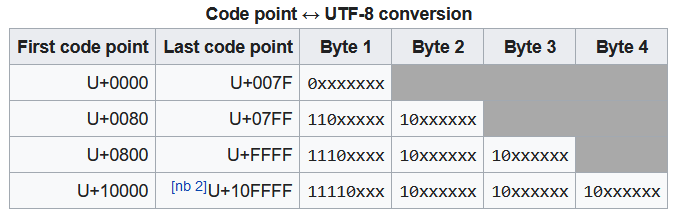

# Common Collections

> &emsp;&emsp;集合数据类型（collections），是编程语言中可以表达多个值的类型。不同于标量类型只能表达单一的值。**这些集合将持有的数据存储在堆上，不需要在编译时确定大小。**这带来了极大的编程便利性。Rust中，广泛使用的集合类型主要有三种：动态数组 `Vector`, 字符串 `String`, 哈希映射 `hash map`。


## Vector 动态数组

Rust中的动态数组为`Vec<T>`，**允许在单个数据结构中，存储多个相同类型的数据。**

其中，`T`表示数组中元素的类型，Rust应用了泛型系统，这部分将在后面详细学习。

### Vector Definition

使用`Vec::new()`关联函数创建一个空数组。**注意：如果需要修改vector，仍必须将其声明为`mut`**

```rust
fn main() {
    let mut a = Vec::new();		// compiler can infer that `a` is Vec<i32>
    							// infer from code below (insertions)
    a.push(1);
    a.push(2);
    a.push(3);
}
```

**根据Vector中初始元素的类型，编译器通常能够自动完成类型推导。**当无法自动推导时（*初始化一个空的列表，也没有进行初始push*），需要手动指定元素类型。

另外，也可以使用`vec![]`宏，快速初始化一个vector：

```rust
let a = vec![1, 2, 3];
```

### Vector Update

使用`push`和`pop`方法来向vector中增加、删除元素（类似栈，如果需要队列形式，可以使用`VecDeque`双端队列）。

```rust
fn main() {
    let mut a = vec![1, 2, 3];

    a.push(4);
    println!("pop a = {}", a.pop().unwrap_or(-1));
    println!("now, len(a) = {}", a.len());
}
```

* `pop`方法返回一个`Option`类型的值，如果vector为空，范围`None`，否则为`Some<T>`

### Vector Destruction

与其他变量相同，当变量离开作用域，会自动触发drop析构。**其所有元素都被销毁**。所以，不能向外部传输一个对局部vector元素的引用

### Vector element access

有两种方法可以访问vector中的元素.

#### vector index

与C/C++类似，使用方括号索引，并加上引用符号`&`，可以访问vector对应位置的元素。*若不加`&`符号*详见[Reference of elements](#Reference of elements)

```rust
let a = vec![1, 2, 3];
let b = a[2];	// rust compiler infers that b: &i32;
```

当对应索引位置的元素不存在时，**程序直接`panic`**，在遇到不可恢复错误的时候可以使用。
#### Vec::get

`get`方法会返回一个`Option<T>`，当指定索引的元素不存在，会返回`None`，这样就可以使用`match`语句进行分支匹配。

```rust
fn main() {
	let a = vec![1, 2, 3];
	for i in 0..4	{
		match a.get(i) {
			Some(x) => println!("a_{} = {}", i, x),
			None => {
				println!("out of range!");
				break;
			},
		}
	}
}
```

**所有权规则和借用规则**

使用vector同样需要遵守单个元素和全局（整个vector）的所有权规则和借用规则，例如：

* *当存在对一个元素的不可变引用时*，**不可对整个vector进行update操作**
    由于vector的更新可能引发原有元素引用失效，或整体vector位置移动（需要扩容时，当前位置没有合适空间），可能导致悬垂引用。编译器将直接拒绝这些危险操作

* 接上一条，*即使存在一个可变引用*，也不能进行操作。这违反了**借用规则**的 "Can't borrow `object` as mutable more than once at a time"，即不能同时存在对一个变量的**两个可变借用**。同样，这个规则可以避免上一条中出现的悬垂引用问题。

* **不能返回一个local vector的元素引用**，这将破坏借用规则的**生命周期**问题。

* 另外，*编译器会检查引用使用位置*，如果编译器检查到该引用后续没有被使用，则会自动将其标为失效的，**不会对后续继续借用产生冲突**影响。
    例如：

    ```rust
    fn main() {
    	let mut a = vec![String::from("123"),String::from("123"), String::from("123")];
    	let b = &mut a[2];
    	a[2].push_str(" string");
        b.push_str("test");
    	println!("{}", a[2]);
    }
    ```

    以上会报错，因为line 5的`a[2]`借用与已经存在的`b`产生冲突，并且，b在后面被使用过，所以在line 5时，该借用仍然是有效的。

    ```rust
    fn main() {
    	let mut a = vec![String::from("123"),String::from("123"), String::from("123")];
    	let b = &mut a[2];
    	b.push_str("test");
    	a[2].push_str(" string");
    	println!("{}", a[2]);
    }
    ```

    以上是被允许的，因为`b`在`a[2]`的第二个借用后面没有继续使用，编译器认为其失效了

#### Reference of elements

*本节为笔者自行实验总结内容，如有错误烦请指正*

一般使用 `&[]`或者`get(index)`方法获取vector的元素，得到的是一个引用。**该引用指向vector中对应索引的元素**。

当vector是可变的，可以直接使用`[]`修改对象，而不需要使用`&`引用（实际上，获得可变引用后使用`*`解引用具有同样效果，但是这样就多此一举了）。

```rust
// rust reference and index test
fn main() {
	// let a = vec![1, 2, 3];
	let mut a = vec![String::from("123"),String::from("123"), String::from("123")];
	a[2] = String::from("456");
	a[2].push_str(" string");
	println!("{}", a[2]);
}
```

以上内容和C/C++较为类似，但Rust增加的安全检查机制在下面会得到体现：

当不使用引用符号`&`时：

* 若元素类型实现了`copy` trait，将元素赋值给其他变量，会进行元素复制，如`i32`类型

    ```rust
    let mut a = vec![1, 2, 3];
    let b: i32 = a[2];
    assert!(b, 3);
    ```

* 若元素没有实现`copy`，则会报**编译时错误**：
    cannot move out of index of `Vec<T>`
    move occurs because value has type `T`, which does not implement the `Copy` trait
    无法从索引中移出元素的值，因为元素类型没有实现`copy` trait。这表明，当不加引用时，发生了值的移动，**当试图从vector中将元素的值移出，就会报错**，因为这会导致元素失效，从而使整个vector失效（value moved）

* 所以我们一般使用**引用**来访问vector的具体元素

### Vector Iterating

Rust提供 iterator 迭代器来进行集合数据类型的遍历。使用`for iter in &vector`引用进行遍历

```rust
    let v = vec![100, 32, 57];
    for i in &mut v {
        *i += 50;
        println!("{}", i);
    }
```

* 如果需要使用可变引用，则增加`mut`关键字，如果不需要则迭代器不可变
* 在Rust中，迭代变量与C/C++不同，`Vector<T>`的迭代变量类型为`T`，对应地, `&Vector<T>`的迭代变量类型为`&T`

**遍历将调用对象的**`into_iter()`方法，**如果不添加引用，则会导致整体的value move**（*由于vector中的元素整体搬移，不会产生错误*）

### Enum in vector

Rust中的vector仅支持单一的变量类型，如果需要多种变量类型，可以使用`Enum`枚举类型作为Vector 的 `inner`类型，并使用关联数据存储对应的数据值。*在这一点上，`Enum`类似于C/C++的`union`联合类型*

```rust
    enum SpreadsheetCell {
        Int(i32),
        Float(f64),
        Text(String),
    }

    let row = vec![
        SpreadsheetCell::Int(3),
        SpreadsheetCell::Text(String::from("blue")),
        SpreadsheetCell::Float(10.12),
    ];
```

上面的例子使用`SpreadsheetCell`创建了一个包含三种变量类型的枚举类型。

如果没有办法穷尽每种类型，**可以使用动态 trait**作为vector 的 inner type，这样可以存储实现了同种特性的所有数据类型。


## String 字符串

### definition

实际上，Rust核心部分只有`str`字符串切片类型，并通常以借用`&str`的形式出现，`String`类型则是**拥有所有权机制的字符串拓展类型。**我们所说的字符串，同时指这两种，而不是单独一种。

这两种类型都采用**UTF-8 编码**，编码的具体格式如下：



* 其中最常用的，英文编码占1B，中文编码占3B

Rust标准库还包含了其他字符串类型，有不同的编码或存储模式，可以通过API查看对应信息。

### Create a New String

`String::New()`方法可以建立一个**空**的字符串

```rust
let mut a = String::new();
```

可以在**字符串字面量或其他实现`Display` trait的类型上**调用`to_string()`方法， 转化成字符串变量。

或者使用`String::from(str_var)`函数，将**字符串字面量类型或引用**转换为`String`类型。

### Update a String

* `push_str`方法，在String后添加一段字符串切片

* `push`方法，添加一个字符（Rust中字符同样是`''`单引号包含）

* `+`运算符，允许字符串拼接(`concat`)

    * 标准库实现了`+=` 操作（魔术方法为`AddAssign`），内部调用`push_str`

        ```rust
        impl AddAssign<&str> for String {
            #[inline]
            fn add_assign(&mut self, other: &str) {
                self.push_str(other);
            }
        }
        ```

* `format!`宏，类似于C/C++的`sprintf` 

    ```rust
    let a: String = format!("{}-{}-{}", year, month, day);
    ```

### String Index

**String不支持直接索引**，这和字符串的内存布局有关。

之前已经说到，字符串内部存储使用了`UTF-8`编码，一个字符占位可能不只1B，`len()`方法只能返回字节长度。*如果使用索引，可能遇到非单字节字符，甚至单个字符内部，导致问题*（不同于Python，Rust的字符索引机制仍按照字节进行）。

另外，直接使用索引，返回值没有确定类型，*可能是字符、字节、或是字形簇*。所以不能直接使用索引。

### Slicing Strings 字符串切片

虽然String不提供直接索引字符，但可以使用字符串切片替代，**字符串切片按照字节划分，返回一个`&str`**

**Attention: **如果没有按照字符边界划分切片（字节范围**落在一个字符编码中间**），会产生运行时错误 (panic)

```rust
let a = "你好".to_string();
let panic_slice = &a[0..1];		// will cause panic
// index i is not a char boundary, it's inside `C` (bytes a..b) of `str`
```

* 由panic说明可见，没有划分到完整的字符，将导致运行时panic，程序直接结束。所以应当做好字符串的切片范围运算。

### String Iteration

* 使用`chars()`方法返回一个**以字符划分的迭代器**
    * iterator var type: `char`
* 使用`bytes()`方法返回一个**以字节划分的迭代器** 
    * iterator var type: `u8`


## Hash Maps 哈希映射表

类似于Python中的`Dictionary`和C++中的`Map`，`HashMap<K, V>`存储了`K`类型键到`V`类型值之间的映射关系。它使用Hash算法维护一个映射关系表。

它实现了Debug trait，可以使用`{:?}`format进行打印

### Create a Hash Map

Preload中没有Hash Map，需要从标准库中显式导入。

```rust
use std::collections::HashMap;

fn main() {
	let mut scores = HashMap::new();

}
```

还可以将两个长度相同的`Vector`通过zip方法生成一个Hash Map

```rust
use std::collections::HashMap;

fn main() {
	let mut teams = vec![String::from("Blue"), String::from("Red")];
    let init_scores = vec![10, 50];
    
    let scores: HashMap<_, _> = 
    teams.iter().zip(initial_scores.iter()).collect();
}
```

* 其中，`zip`方法将两个iterator组成一个元组数组，再使用`collect()`方法，将数组转换成Hash Map

### Update Hash Map

使用以下两种方法进行更新：

* `insert(K, V)` 将插入键值对，若已存在，**将更新原键值对**
* `try_insert(K, V)` 插入键值对， 若已存在，**不更新**

还可以通过`entry`函数，查找对应的键值对`entry`，通过操作entry对Hash Map进行更新。

```rust
// hash map update test
use std::collections::HashMap;

fn main() {
	let s = "Hello world, this is a test";
	let mut word_count = HashMap::new();
	for c in s.chars() {
		let count = word_count.entry(c).or_insert(0);
		*count += 1;
	}
	for (c, count) in word_count {
		println!("count of {} = {}", c, count);
	}
}
```

* `entry(c)` 在 hash map 中搜索指定的entry，返回一个Entry，其中**值可能为空**，这里没有采用`Option`方法，该实现将在下一节`get`方法中讲到。
* `or_insert`方法返回一个`V`类型的**可变引用**，它确保了键值对一定存在，若不存在，则向Map中插入一个新的值。
* Hash Map 的`into_iter`函数将迭代产生一系列键值对，**以元组的形式表达**。与Python类似，可以使用`()`对元组进行解包，得到单独的变量

### Accessing Values

上面已经提到了，可以使用`entry`方法获取键值对，更常见的获取值（可能存在）的方法是`get(Key)`

将返回一个`Option<&V>`类型变量，如果Hash Map中不存在该Key，则返回`None`

* 若需要可变引用，则使用`get_mut()`方法


### Hash Map Entry

`Entry` 是 `std::collections::hash_map`中定义的`Enum`枚举类型，含有两个变体：

* **Occupied**：表示该Entry已被使用（已含有键）
* **Vacant**：空缺，未被占用

分别关联两个另外定义的类型`OccupiedEntry`和`VacantEntry`

本类型变量由`HashMap`的`entry`函数创建

主要实现以下方法，用于解析得到KV pair，或是生成一个新的

* `or_insert`，接受默认值V，返回一个Value的可变引用
* `or_insert_with`，接收一个空参数函数F，返回Value的可变引用，若为空，则返回函数的返回值
* `or_insert_with_key`，接收**一个参数为Key**的函数，其余同上
* `Key`，返回Entry对应的Key
* `and_modify`，接收一个`&mut v`的函数参数，在可能的插入之前，对`Occupied` entry提供就地可变访问（in-place mutable access）
* `or_default` ，如果不存在，使用Default Value of `V`
    * 实现在`<'a, K, V: Default>`上，value必须实现`Default` trait

### Hash Function

Hash Map为了抵御Dos攻击，默认使用在密码学上安全的Hash函数，损失了一定的运行效率。可以指定不同的**Hash计算工具**来进行Hash运算，只要实现`BuildHasher` trait的类型都可以作为Hash Function